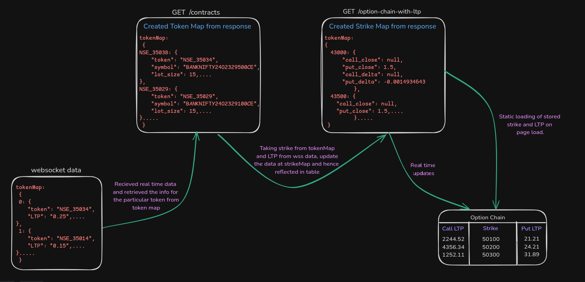

# Option Data Fetching and Update Logic

This document outlines the logic and flow of fetching option data and updating it in real-time based on incoming WebSocket data. The process involves interacting with two APIs and using a WebSocket to ensure the UI is always up-to-date.
For better understanding I also attached the flow diagram how the approach is working:

## Flowchart


   
## Table of Contents
- [Overview](#overview)
- [Data Flow Steps](#data-flow-steps)
  
## Overview

The application fetches data related to financial options for various indices (e.g., Nifty, BankNifty, Sensex) and updates it dynamically. It does this through two primary APIs and handles real-time updates via WebSocket.


## Folder Structure

```bash
src
├── Components
│   ├── BottomNav
│   │   ├── BottomNav.tsx
|   |   ├── BottomNav.css
│   ├── CenteredText
│   │   ├── Center.css
│   │   ├── CenteredText.tsx
│   ├── Dropdowns
│   │   ├── Dropdown
│   │   │   ├── Dropdown.css
│   │   │   ├── Dropdown.tsx
│   │   ├── DropdownSecond
│   │   │   ├── DropdownSecond.css
│   │   │   ├── DropdownSecond.tsx
│   │   ├── DropdownThird
│   │   │   ├── dropdownthree.css
│   │   │   ├── DropdownThree.tsx
│   ├── SettingsDropdown
│   │   ├── settings.css
│   │   ├── Settings.tsx
├── ExpiryStatus
│   ├── ExpiryStatus.css
│   ├── ExpiryStatus.tsx
├── Navbar
│   ├── Navbar.css
│   ├── Navbar.tsx
├── OptionHelp
│   ├── Options.css
│   ├── OptionsHelp.tsx
├── StrategyHeader
│   ├── StrategyHeader.css
│   ├── StrategyHeader.tsx
├── TableUtils
│   ├── Modal.css
│   ├── Modal.tsx
│   ├── Table.css
│   ├── TableBigScreen.tsx
│   ├── TableContainer.tsx
│   ├── TableSmallScreen.tsx
├── TwoCols
│   ├── TwoColumnLayout.css
│   ├── TwoColumns.tsx
├── Utils
│   ├── interfaces.ts
│   ├── utils.ts
├── CustomIcon.tsx
├── Header.tsx
├── Navigation.tsx
├── Store
├── App.css
├── App.tsx
├── index.css
├── main.tsx
```


## Data Flow Steps

1. **Fetch Contract API (`/api/contracts`)**
   - Fetches a list of available options and their details.
   - Sets the first available option (e.g., BankNifty) as the default selection.

2. **Set Dropdowns and Date Options**
   - Extracts and sorts available date options from the selected option's details.
   - Sets the first available date for further processing.

3. **Fetch Contract Details for the Selected Date**
   - Extracts contract details for the selected date.
   - Creates a `contractMap` using the token as the key for quick access.
   - Obtains unique strikes from the contract details for later use.

4. **Fetch Option Chain with LTP API (`/api/option-chain-with-ltp`)**
   - Fetches option chain data for the selected option (e.g., BankNifty) and date.
   - Creates a `strikeMap` where each strike price maps to its corresponding call and put values (e.g., `call_close`, `put_close`, etc.).

5. **Populate `RowData` Based on Unique Strikes**
   - Iterates through each unique strike.
   - Populates `RowData` using values from the `strikeMap`.

6. **Update Data from WebSocket (`ltpData`)**
   - Listens for incoming WebSocket data updates.
   - For each update, checks the `contractMap` using the token.
   - Updates the respective row's `call_close` or `put_close` based on the `option_type` (CE for call, PE for put).


 